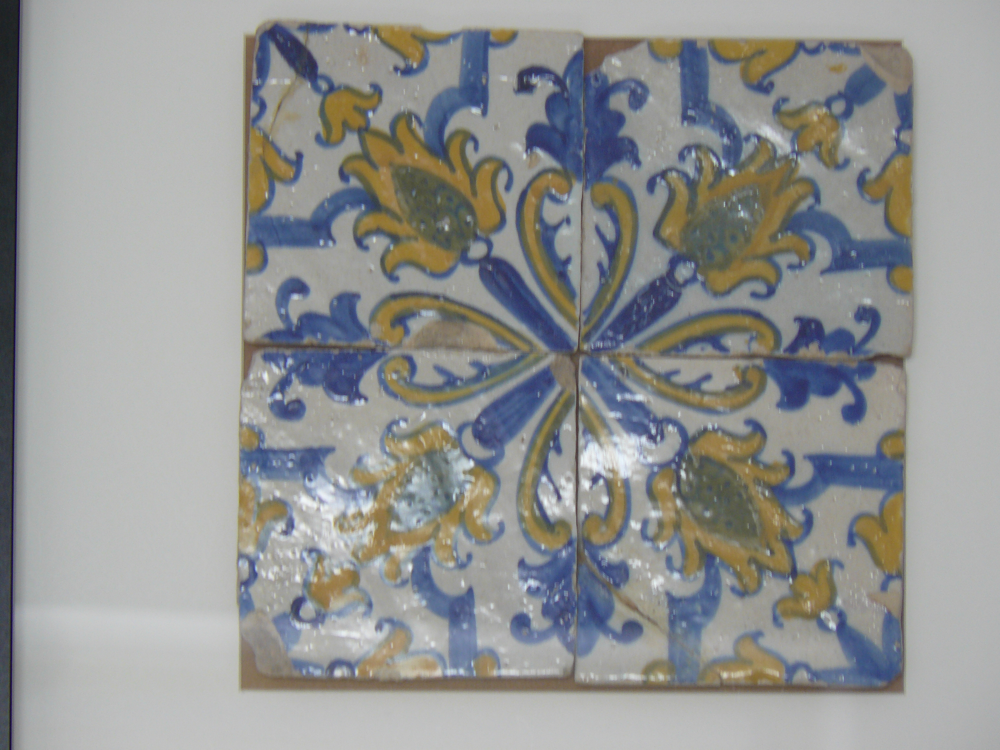

.. notes documentation master file, created by
   sphinx-quickstart on Sat Sep 13 19:39:21 2014.
   You can adapt this file completely to your liking, but it should at least
   contain the root `toctree` directive.

Welcome to notes's documentation!
=================================

Blllllllll

hodohhvcx

jfjgioeogo

Contents:

.. toctree::
   :maxdepth: 2

Indices and tables
==================

* :ref:`genindex`
* :ref:`modindex`
* :ref:`search`

